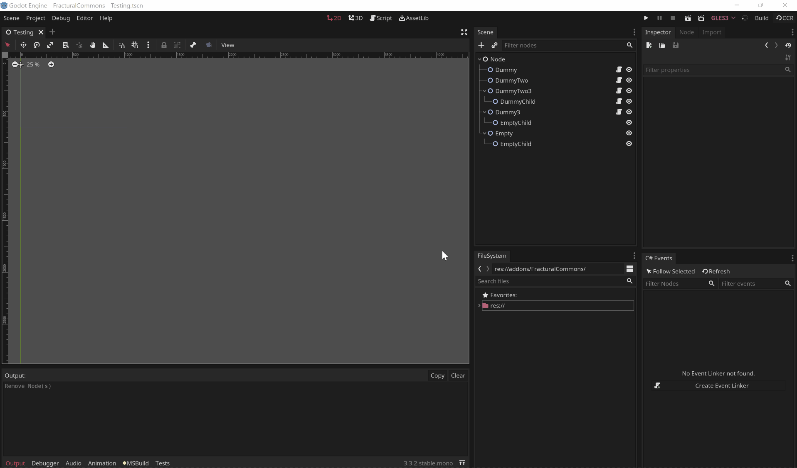
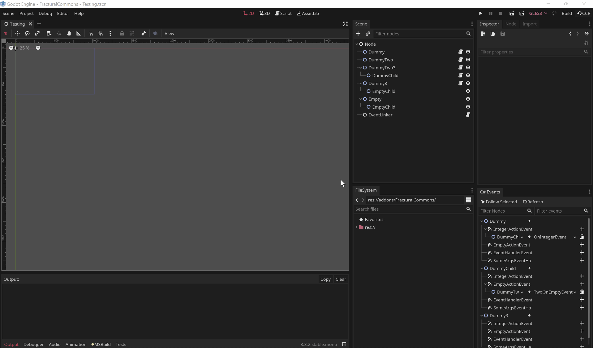

# FracturalCommons

Collection of commonly used GDScript and C# scripts for Godot.

Current features:
- Custom types
  - Vector2Int
- Editor for linking C# events in inspector
- Utility classes

## Plugin Layout
The different parts of this general purpose plugin are called "Plugin Modules". To customize plugin modules, simply go to the `res://addons/FracturalCommons/Plugin.cs` and remove or add `LoadModule()` methods inside `LoadPluginModules()` to load only the modules that you need.

**Ex.**

```C#
// res://addons/FracturalCommons/Plugin.cs
...

    [Tool]
    public class Plugin : ModularPlugin
    {
        ...

        public override void LoadPluginModules()
        {
            // Remove this if you don't want to load the CSharpEvent
            LoadModule(new InspectorCSharpEventsPluginModule());
        }

        ...
    }

...
```

This module based system even enables you to add new behavior by making your own `PluginModuls`.

## Installation

1. Go to the [releases tab](https://github.com/Fractural/FracturalCommons/releases/) on the Github repository and find the release you want
2. Download the `FracturalCommonsRelease.zip` file and extract it.
3. After extraction, move both the `FracturalCommons` folder and the `MonoCustomResourceRegistry` folder into the `res://addons` folder of your project.
4. Rebuild the solution to your project and first enable `MonoCustomResourceRegistry`, then enable  `FracturalCommons`.

Note that `MonoCustomResourceRegistry` is only required for custom C# nodes to appear in the `Create Node` menu. This plugin is a workaround for a Godot editor bug. The original repo for this plugin can be found [here](https://github.com/Atlinx/Godot-Mono-CustomResourceRegistry).

# Modules

## C# Events Inspector

This module creates an inspector window that allows you to link C# events in the Godot editor.

This inspector is compatible with any C# event, including `Action` and `EventHandler` events.

### Documentation

**Refresh Button** - Refreshes the events inspector to the current state of the scene. 

- The events inspector auto refreshes when:
    - a new scene is loaded.
    - a new node is selected and the `Follow Selected Button` is toggled on.
    - the resolution is rebuilt.
- You will have to manually press the **Refresh Button** if you delete, rename, or add a new node to the scene.  

**Follow Selected Button** - When toggled on, the events inspector will show only the currently selected node.

- When toggled, the events inspector will refresh automatically when you change your selected node.
- This simulates the behavior of the "Node" window that's built into Godot, as the "Node" window only shows the signals emitted by the currently selected node.

**Filter Nodes Search Bar** - Lets you filter the displayed nodes by their names.

**Filter Events Search Bar** - Lets you filter the displayed events by their names

**Create Event Linker Button** - Appears when no event linker is found. When pressed, it will create a node named "EventLinker" at the bottom of the scene.

- Event linker nodes have a `EventLinkerXX.cs` script created for them, where `XX` represents the next available number.
- All event linker scripts can be found under `res:\\addons\FracturalCommons\InspectorCSharpEvents\EventLinkers\`

### Use

#### Adding Event Listener
1. Open a scene
2. Press the **Create Event Linker Button** to create an event linker for that scene.
3. Find an event on the node you want.
4. Click on the `+` button on the right of the event to add a new event listener.
5. Click on the first `Empty` slot to assign the listener's node.
6. Click on the second `Empty` slot to assign the method on the listener's node.
    
    - The method select window will only show methods that are compatible with the event.

**Ex.**



#### Deleting Event Listener

1. Find an event on the node you want.
2. Press the `trash can` button on the left of the listener to delete it.

**Ex.**



### Notes

This module procedurally generates C# code that links events to listeners. The linked C# events are stored in a node named "EventLinker" at the bottom of the scene's tree.

The events are linked during `_EnterTree()`, therefore "EventLinker' must always be placed at the bottom of the scene to ensure all the nodes have entered the tree when it links up the events. This behavior lets the event linking finish before `_Ready()` is called on any node.